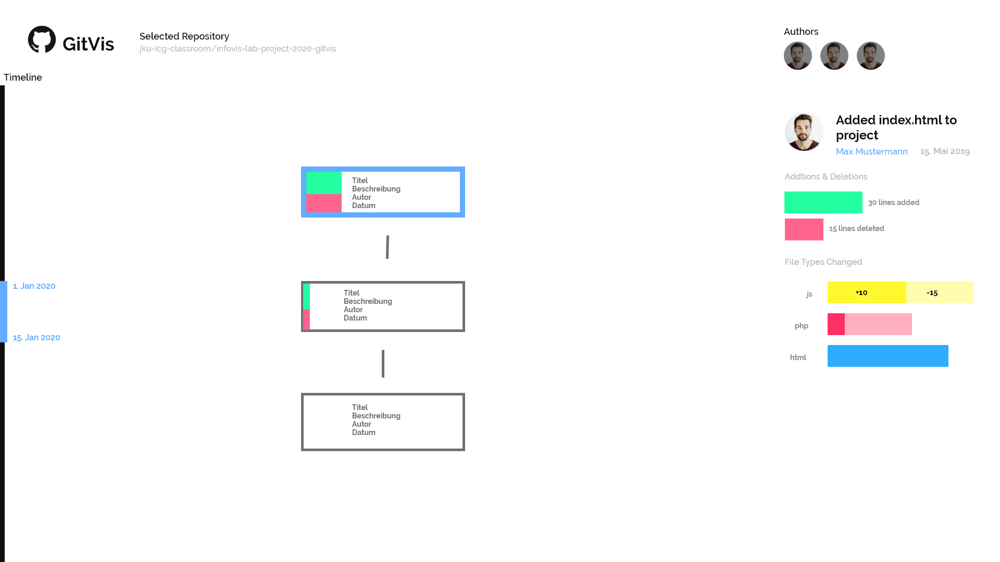
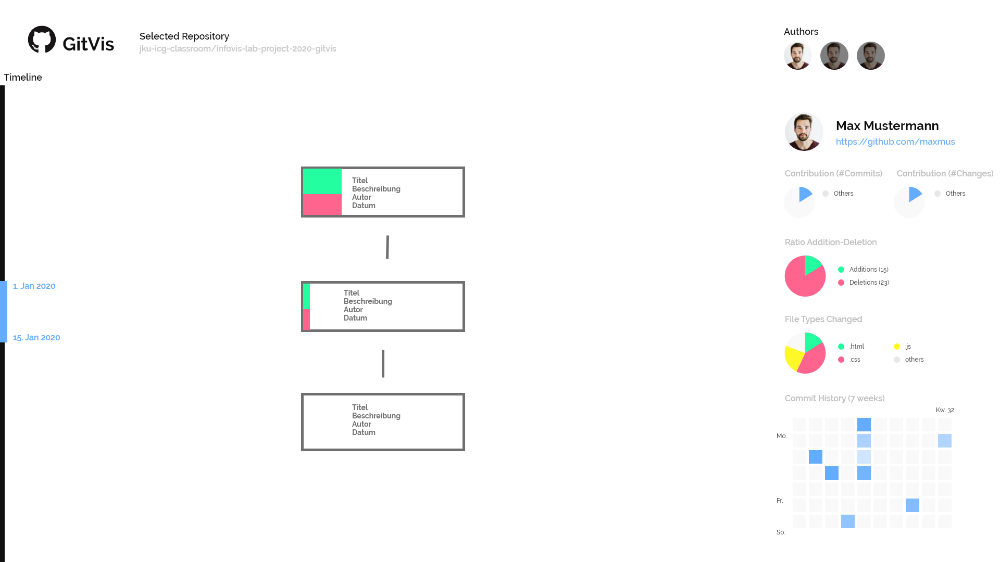

# InfoVis Lab Project
Submission template for the InfoVis lab project at the Johannes Kepler University Linz.

**Explanation:**
This `README.md` needs to be pushed to Github for each of the 3 delivery dates.
For every submission change/extend the corresponding sections by replacing the [TODO] markers.
*In order to meet the deadlines make sure you push everything to your Github repository.*
For more details see [*Moodle page*](https://moodle.jku.at/jku/course/view.php?id=9291).

**Tip:** Make yourself familiar with [Markdown](https://github.com/adam-p/markdown-here/wiki/Markdown-Cheatsheet).

# Submission due on 22.04.2020

## General Information

**Project Name:** GitVis

**Group Members**

| Student ID    | First Name  | Last Name      |
| --------------|-------------|----------------|
| [11714228]        | [Richard]      | [Wolfmayr]         |
| [11705011]        | [Michael]      | [Artner]         |
| [11776897]        | [Elias]      | [Burgstaller]         |

## Dataset

* What is the dataset about?
* Where did you get this dataset from (i.e., source of the dataset)?
* How was the dataset generated?
* What is dataset size in terms of nodes, items, rows, columns, ...?
* How is the dataset structured?

[The dataset is about the commits of the last few days of a git repository.
The data is retrieved by using the REST-API of git. https://developer.github.com/v3/
The dataset is generated by a tool we wrote ourselves. This tool uses the API to query all latest commits, 
then iterates over all those commits and queries more details like e.g. the detailes information about changed files.
This is put into JSON format and printed.
The size depends on how many commits have been done in the specified amount of days.
The maximum amount of REST-calls is limited to 60 for now, but we will probably be able to increase this.
For every commit there is a node and this node has several childnodes, best explained in this example:
```javascript
[
{
    "sha": "bc01300ead9f2cd59202b8737f75370428b615ec",
    "node_id": "MDY6Q29tbWl0NDk3MTcxMzpiYzAxMzAwZWFkOWYyY2Q1OTIwMmI4NzM3Zjc1MzcwNDI4YjYxNWVj",
    "commit": {
        "author": {
            "name": "Richard Wolfmayr",
            "email": "richard.wolfmayr@gmail.com",
            "date": "2020-04-03T11:58:16Z"
        },
        "committer": {
            "name": "Richard Wolfmayr",
            "email": "richard.wolfmayr@gmail.com",
            "date": "2020-04-03T11:58:16Z"
        },
        "message": "if free material creates an exaportitem, a new subjectcategory called \"free materials\" is created if it does not exist yet",
        "tree": {
            "sha": "48abd20c73bba6ee7c4e6afe933fd696b72949f4",
            "url": "https://api.github.com/repos/gtn/exacomp/git/trees/48abd20c73bba6ee7c4e6afe933fd696b72949f4"
        },
        "url": "https://api.github.com/repos/gtn/exacomp/git/commits/bc01300ead9f2cd59202b8737f75370428b615ec",
        "comment_count": 0,
        "verification": {
            "verified": false,
            "reason": "unsigned",
            "signature": null,
            "payload": null
        }
    },
    "url": "https://api.github.com/repos/gtn/exacomp/commits/bc01300ead9f2cd59202b8737f75370428b615ec",
    "html_url": "https://github.com/gtn/exacomp/commit/bc01300ead9f2cd59202b8737f75370428b615ec",
    "comments_url": "https://api.github.com/repos/gtn/exacomp/commits/bc01300ead9f2cd59202b8737f75370428b615ec/comments",
    "author": {
        "login": "richardwolfmayr",
        "id": 24298463,
        "node_id": "MDQ6VXNlcjI0Mjk4NDYz",
        "avatar_url": "https://avatars0.githubusercontent.com/u/24298463?v=4",
        "gravatar_id": "",
        "url": "https://api.github.com/users/richardwolfmayr",
        "html_url": "https://github.com/richardwolfmayr",
        "followers_url": "https://api.github.com/users/richardwolfmayr/followers",
        "following_url": "https://api.github.com/users/richardwolfmayr/following{/other_user}",
        "gists_url": "https://api.github.com/users/richardwolfmayr/gists{/gist_id}",
        "starred_url": "https://api.github.com/users/richardwolfmayr/starred{/owner}{/repo}",
        "subscriptions_url": "https://api.github.com/users/richardwolfmayr/subscriptions",
        "organizations_url": "https://api.github.com/users/richardwolfmayr/orgs",
        "repos_url": "https://api.github.com/users/richardwolfmayr/repos",
        "events_url": "https://api.github.com/users/richardwolfmayr/events{/privacy}",
        "received_events_url": "https://api.github.com/users/richardwolfmayr/received_events",
        "type": "User",
        "site_admin": false
    },
    "committer": {
        "login": "richardwolfmayr",
        "id": 24298463,
        "node_id": "MDQ6VXNlcjI0Mjk4NDYz",
        "avatar_url": "https://avatars0.githubusercontent.com/u/24298463?v=4",
        "gravatar_id": "",
        "url": "https://api.github.com/users/richardwolfmayr",
        "html_url": "https://github.com/richardwolfmayr",
        "followers_url": "https://api.github.com/users/richardwolfmayr/followers",
        "following_url": "https://api.github.com/users/richardwolfmayr/following{/other_user}",
        "gists_url": "https://api.github.com/users/richardwolfmayr/gists{/gist_id}",
        "starred_url": "https://api.github.com/users/richardwolfmayr/starred{/owner}{/repo}",
        "subscriptions_url": "https://api.github.com/users/richardwolfmayr/subscriptions",
        "organizations_url": "https://api.github.com/users/richardwolfmayr/orgs",
        "repos_url": "https://api.github.com/users/richardwolfmayr/repos",
        "events_url": "https://api.github.com/users/richardwolfmayr/events{/privacy}",
        "received_events_url": "https://api.github.com/users/richardwolfmayr/received_events",
        "type": "User",
        "site_admin": false
    },
    "parents": [
        {
            "sha": "5a7720a71de380566f956db14b5e9fd2d4b5043c",
            "url": "https://api.github.com/repos/gtn/exacomp/commits/5a7720a71de380566f956db14b5e9fd2d4b5043c",
            "html_url": "https://github.com/gtn/exacomp/commit/5a7720a71de380566f956db14b5e9fd2d4b5043c"
        }
    ],
    "stats": {
        "total": 20,
        "additions": 16,
        "deletions": 4
    },
    "files": [
        {
            "sha": "855f8bec6a2682cd889286cb9713ebd79d93aa79",
            "filename": "externallib.php",
            "status": "modified",
            "additions": 8,
            "deletions": 4,
            "changes": 12,
            "blob_url": "https://github.com/gtn/exacomp/blob/bc01300ead9f2cd59202b8737f75370428b615ec/externallib.php",
            "raw_url": "https://github.com/gtn/exacomp/raw/bc01300ead9f2cd59202b8737f75370428b615ec/externallib.php",
            "contents_url": "https://api.github.com/repos/gtn/exacomp/contents/externallib.php?ref=bc01300ead9f2cd59202b8737f75370428b615ec",
            "patch": null
        },
        {
            "sha": "a903a7ca9bf6e1c2404fd6036417008099edb430",
            "filename": "lang/de/block_exacomp.php",
            "status": "modified",
            "additions": 1,
            "deletions": 0,
            "changes": 1,
            "blob_url": "https://github.com/gtn/exacomp/blob/bc01300ead9f2cd59202b8737f75370428b615ec/lang/de/block_exacomp.php",
            "raw_url": "https://github.com/gtn/exacomp/raw/bc01300ead9f2cd59202b8737f75370428b615ec/lang/de/block_exacomp.php",
            "contents_url": "https://api.github.com/repos/gtn/exacomp/contents/lang/de/block_exacomp.php?ref=bc01300ead9f2cd59202b8737f75370428b615ec",
            "patch": null
        },
        {
            "sha": "83a187a0692373d47c4a01bf17e523ba0ef13280",
            "filename": "lang/en/block_exacomp.php",
            "status": "modified",
            "additions": 1,
            "deletions": 0,
            "changes": 1,
            "blob_url": "https://github.com/gtn/exacomp/blob/bc01300ead9f2cd59202b8737f75370428b615ec/lang/en/block_exacomp.php",
            "raw_url": "https://github.com/gtn/exacomp/raw/bc01300ead9f2cd59202b8737f75370428b615ec/lang/en/block_exacomp.php",
            "contents_url": "https://api.github.com/repos/gtn/exacomp/contents/lang/en/block_exacomp.php?ref=bc01300ead9f2cd59202b8737f75370428b615ec",
            "patch": null
        },
        {
            "sha": "6ef1aa2ca9ed8ae7b97e32a2619971e4b3a37214",
            "filename": "lang/total.php",
            "status": "modified",
            "additions": 6,
            "deletions": 0,
            "changes": 6,
            "blob_url": "https://github.com/gtn/exacomp/blob/bc01300ead9f2cd59202b8737f75370428b615ec/lang/total.php",
            "raw_url": "https://github.com/gtn/exacomp/raw/bc01300ead9f2cd59202b8737f75370428b615ec/lang/total.php",
            "contents_url": "https://api.github.com/repos/gtn/exacomp/contents/lang/total.php?ref=bc01300ead9f2cd59202b8737f75370428b615ec",
            "patch": null
        }
    ]
}
]
```

## User Tasks & Goals

* What are the user tasks?
* What would users like to see/get from the dataset?

[The user is a developer using git. 
-Which commit(s) possibly caused the bug?
-Which developer committed at what time?
-Who are the main contributors?
-What type of files are changed by which developer most frequently?]

# Submission due on 13.05.2020

## Proposed Dashboard Solution

* Which type of visualizations did you use?
* Explain why you chose these visualizations?
* Add sketches or images if possible

### Commit History Vis
For the visualization of the commithistory we used a graph, specifically a Directed Acyclic Graph. 
We decided to use a graph because the structure we get from Git is inherently a DAG already.
Each commit is represented by a node. Each node contains some textual information of this commit like title, author, date as well 
as two bars for deleted and inserted lines. The bars do not only show the ratio of deleted/inserted but the breadth of the bars
encodes the amount of lines changed overall. This way, the user can perceive which commit has a lot of lines changed and also 
comparing two commits can be done in an instant.

### Commit Detail Vis
At the top of the commit details view are textual details of the commit. This includes title/description, author and date of the commit. 
Also the number of additions and deletions is shown as bar graph (same data as in the node, but with two bars comparing is easier than with the stacked bars in the node).
Beneath this is a detailed section of the different file types. With a stacked bar chart the additions and deletions for each file type are visualized. The types are located on the y-axis so the width of the bars encodes the number of additions/deletions. To further 
differentiate between the bars, the types have different hues and the additions are slightly brighter than the deletions.

### Author Detail Vis
Visualizations that are being used:
- Image: for author avatar; trivial
- Text: for author name and link to github; trivial
- Pie-Chart: for # of commits (in total); easy to perceive the ratio of #commits_of_author / #commits_total
- Pie-Chart: for # of changes (in total; additions + deletions); easy to perceive the ratio of #changes_of_author / #changes_total where changes represents the #lines (additions + deletions) that have been changed
- Pie-Chart: for the ratio of additions and deletions (in total); easy to perceive if the author adds more than he deletes (or vice-versa)
- Pie-Chart: for the most often changed file types (in total); easy to perceive which file types are most often changed by the autor; because there may be many (>10) different file types that the author has changed, we need to aggregate the data; otherwise a pie-chart would not be suitable for visualizing this (>10 colors needed; many segments; bad)
- Calendar-Matrix: for the author´s commit history of the last 7 weeks; easy to perceive on which days the author commited and how much he commited on that day; design just like on github 




# Submission due on 17.06.2020

## Implementation Details

* How did you implement the dashboard?
* Which external libraries and/or resources did you use?
* Additional information about the implementation

[TODO]

## Limitations

* What are the limitations of your solution?
* Is there anything that a user could not achieve from the given user tasks? Why? What is missing and how must the prototype be improved?

[TODO]

## Findings and Insights

* How does the solution enable users to answer the tasks?
* What are the findings and insights from the dataset?

[TODO]

## Conclusion

* What is your conclusion?

[TODO]
